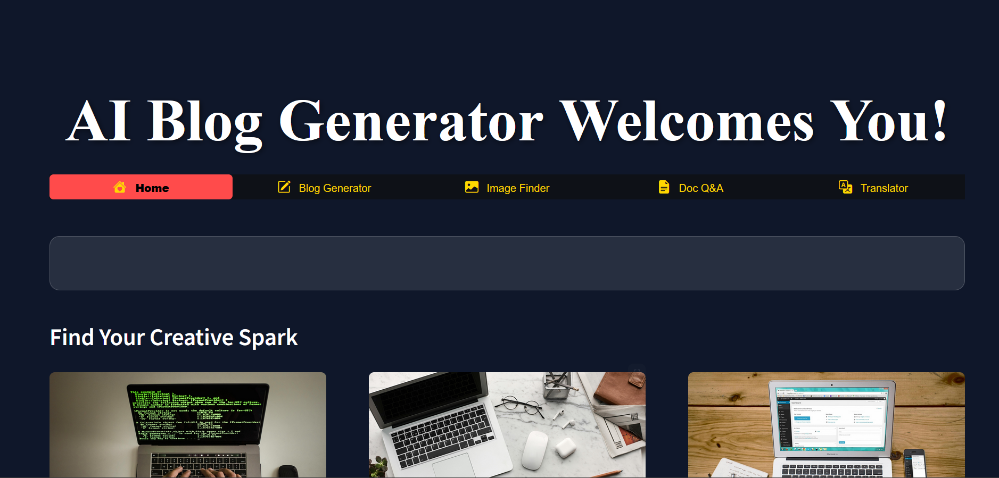

Of course. Here is the entire, fully-formatted README.md content in a single block for easy copying.

Just click the "Copy" button in the top-right corner of the block below and paste it directly into your README.md file.

Generated markdown
# Gemini 1.5 Flash Powered Blog Generator

Welcome to the Gemini 1.5 Flash Powered Blog Generator, a cutting-edge content creation tool built with Python and the Streamlit framework. This application harnesses the speed and power of **Google's Gemini 1.5 Flash model** to instantly generate high-quality, engaging blog posts on any topic.

Beyond text generation, this suite also includes tools for finding images, analyzing documents, and translating content, making it a comprehensive assistant for all your creative needs.

📸 **Application Demo**
***
*(Note: For the image to show, ensure a screenshot named `Blog.png` is in your repository.)*


🚀 **Key Features**
***
This AI suite is packed with features to spark your creativity and boost your productivity:

*   ✍️ **Gemini-Powered Blog Generation:** Instantly create well-structured and engaging blog posts on any topic you provide, powered by the core Gemini 1.5 Flash engine.
*   🖼️ **Image Finder:** Search for and find high-quality, royalty-free images to complement your articles using the Pexels API.
*   ❓ **Document Q&A:** Upload a PDF document and ask questions about its content. Perfect for summarizing long reports or extracting key information.
*   🌐 **Translator:** Break language barriers by translating text into various languages, expanding your content's reach.
*   ✨ **Polished UI:** A clean, intuitive, and multi-page web interface built with Streamlit for a smooth user experience.

🛠️ **Technology Stack**
***
*   **Language:** Python
*   **Framework:** Streamlit (for the web interface and state management)
*   **Core AI & APIs:**
    *   **Google Gemini 1.5 Flash** (Primary for Blog Generation)
    *   OpenAI API
    *   Hugging Face API
    *   Pexels API

🔧 **How to Run This Project**
---
To get the AI Blog Generator running on your local machine, please follow these steps:

#### 1. Clone the Repository
```bash
git clone https://github.com/jai07032005-byte/Codework-.git

2. Navigate to the Project Directory
Generated bash
cd Codework-
IGNORE_WHEN_COPYING_START
content_copy
download
Use code with caution.
Bash
IGNORE_WHEN_COPYING_END
3. Set Up Your Environment Variables

This project requires API keys to function.

Rename the env.template file to .env.

Open the new .env file and replace the placeholder text with your actual secret API keys.

Generated code
GEMINI_API_KEY="YOUR_GEMINI_API_KEY_HERE"
OPENAI_API_KEY="YOUR_OPENAI_API_KEY_HERE"
HUGGINGFACE_API_KEY="YOUR_HUGGINGFACE_API_KEY_HERE"
PEXELS_API_KEY="YOUR_PEXELS_API_KEY_HERE"
IGNORE_WHEN_COPYING_START
content_copy
download
Use code with caution.
IGNORE_WHEN_COPYING_END

Important: Your .env file is listed in .gitignore and should never be pushed to GitHub.

4. Install Required Libraries

This project's dependencies are listed in requirements.txt. Install them using pip:

Generated bash
pip install -r requirements.txt
IGNORE_WHEN_COPYING_START
content_copy
download
Use code with caution.
Bash
IGNORE_WHEN_COPYING_END
5. Run the Application

Execute the following command in your terminal:

Generated bash
streamlit run Welcome.py
IGNORE_WHEN_COPYING_START
content_copy
download
Use code with caution.
Bash
IGNORE_WHEN_COPYING_END

The application will automatically open in a new tab in your web browser. Enjoy creating content with your AI assistant!

Generated code
IGNORE_WHEN_COPYING_START
content_copy
download
Use code with caution.
IGNORE_WHEN_COPYING_END